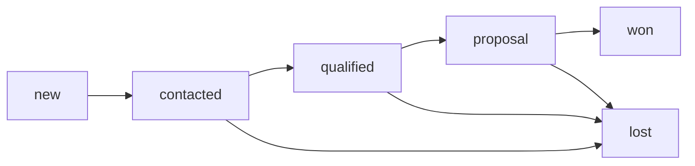

## Overview

The `Lead` model stores qualified sales leads, specifically those who request a free infrastructure diagnosis. This model includes additional tracking fields (`source` and `status`) to manage the sales pipeline.

## Prisma Schema

```prisma
model Lead {
  id        Int      @id @default(autoincrement())
  name      String   @db.VarChar(100)
  email     String   @db.VarChar(200)
  phone     String   @default("") @db.VarChar(30)
  company   String   @default("") @db.VarChar(200)
  message   String   @db.Text
  source    String   @default("diagnosis") @db.VarChar(50)
  status    String   @default("new") @db.VarChar(30)
  read      Boolean  @default(false)
  createdAt DateTime @default(now()) @map("created_at")

  @@map("leads")
}
```

## Fields

<ResponseField name="id" type="Int">
  **Primary Key**: Auto-incrementing unique identifier
  
  Automatically generated when a new lead is created
</ResponseField>

<ResponseField name="name" type="String">
  Full name of the lead
  
  - **Type:** VARCHAR(100)
  - **Required:** Yes
  - **Validation:** 2-100 characters
</ResponseField>

<ResponseField name="email" type="String">
  Email address of the lead
  
  - **Type:** VARCHAR(200)
  - **Required:** Yes
  - **Validation:** Must be valid email format, max 200 characters
</ResponseField>

<ResponseField name="phone" type="String">
  Contact phone number
  
  - **Type:** VARCHAR(30)
  - **Required:** Yes
  - **Default:** Empty string
  - **Validation:** 6-30 characters
</ResponseField>

<ResponseField name="company" type="String">
  Company or organization name
  
  - **Type:** VARCHAR(200)
  - **Required:** No
  - **Default:** Empty string
  - **Validation:** Max 200 characters
</ResponseField>

<ResponseField name="message" type="String">
  Description of infrastructure or problem to diagnose
  
  - **Type:** TEXT
  - **Required:** Yes
  - **Validation:** 10-5000 characters (minimum 10 required for leads)
</ResponseField>

<ResponseField name="source" type="String">
  Lead source for tracking marketing channels
  
  - **Type:** VARCHAR(50)
  - **Default:** `"diagnosis"`
  - **Purpose:** Track where the lead came from
  - **Common Values:** `"diagnosis"`, `"landing_page"`, `"referral"`, `"social_media"`
</ResponseField>

<ResponseField name="status" type="String">
  Current status in the sales pipeline
  
  - **Type:** VARCHAR(30)
  - **Default:** `"new"`
  - **Purpose:** Track lead progression through sales funnel
  - **Common Values:**
    - `"new"`: Just submitted, not contacted yet
    - `"contacted"`: Initial contact made
    - `"qualified"`: Confirmed as qualified lead
    - `"proposal"`: Proposal sent
    - `"won"`: Converted to customer
    - `"lost"`: Did not convert
</ResponseField>

<ResponseField name="read" type="Boolean">
  Indicates if the lead has been reviewed by sales team
  
  - **Type:** BOOLEAN
  - **Default:** `false`
  - **Usage:** Used by admin dashboard to highlight new leads
</ResponseField>

<ResponseField name="createdAt" type="DateTime">
  Timestamp when the lead was created
  
  - **Type:** TIMESTAMP
  - **Default:** Current timestamp
  - **Column Name:** `created_at` (snake_case in database)
</ResponseField>

## Database Table

**Table Name:** `leads`

## Example Record

```json
{
  "id": 15,
  "name": "Carlos Pérez",
  "email": "carlos@miempresa.com",
  "phone": "+51999888777",
  "company": "Mi Empresa SAC",
  "message": "Nuestra página web está lenta y queremos mejorar el rendimiento. También tenemos problemas con los correos que van a spam.",
  "source": "diagnosis",
  "status": "new",
  "read": false,
  "createdAt": "2026-03-05T10:15:00.000Z"
}
```

## Relationships

The `Lead` model has no relationships with other models. It's a standalone table for managing the sales pipeline.

## Usage Flow

1. **User requests diagnosis** → POST to `/api/leads`
2. **API validates data** → Using Zod schema (minimum 10 characters for message)
3. **Lead created** → Inserted with `source: "diagnosis"` and `status: "new"`
4. **Emails sent** → Detailed diagnosis information sent to both parties
5. **Sales team follows up** → Updates `status` and `read` as lead progresses

## Sales Pipeline States



## Difference from Contact Model

The `Lead` model extends the `Contact` model with:

- **`source` field**: Track marketing attribution
- **`status` field**: Manage sales pipeline
- **Required message**: Leads must provide at least 10 characters describing their needs
- **Purpose**: Qualified leads for sales, not just general inquiries

## Query Examples

### Create a Lead

```javascript
const lead = await prisma.lead.create({
  data: {
    name: "Carlos Pérez",
    email: "carlos@miempresa.com",
    phone: "+51999888777",
    company: "Mi Empresa SAC",
    message: "Necesitamos diagnóstico de infraestructura",
    source: "diagnosis",
    status: "new"
  }
});
```

### Get New Leads

```javascript
const newLeads = await prisma.lead.findMany({
  where: { 
    status: 'new',
    read: false 
  },
  orderBy: { createdAt: 'desc' }
});
```

### Update Lead Status

```javascript
await prisma.lead.update({
  where: { id: 15 },
  data: { 
    status: 'contacted',
    read: true 
  }
});
```

### Get Leads by Source

```javascript
const diagnosisLeads = await prisma.lead.findMany({
  where: { source: 'diagnosis' },
  orderBy: { createdAt: 'desc' }
});
```

## Implementation Reference

Source files:
- Schema: `prisma/schema.prisma:23-36`
- API Controller: `src/controllers/leadsController.js:26-28`
- Validation: `src/controllers/leadsController.js:5-11`