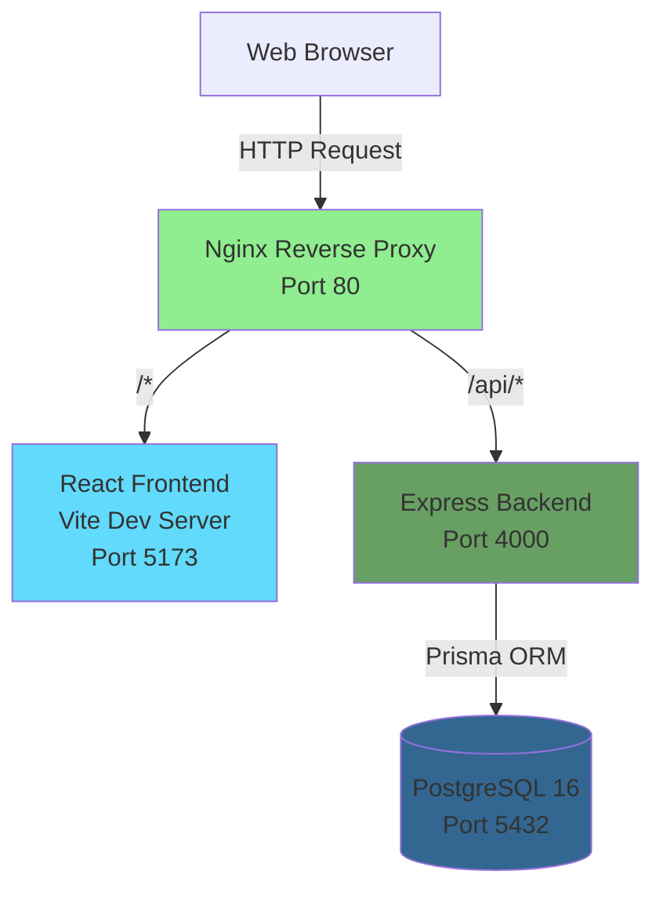

## Overview

Enigma Developers is a full-stack corporate SaaS website built with a modern, containerized architecture. The application uses **Nginx** as a reverse proxy to route traffic between a **React** frontend and an **Express** backend, with **PostgreSQL** as the database.

## Architecture Diagram



## Request Flow

The Nginx reverse proxy routes incoming requests based on the URL path:

```
nginx:80
├── /api/*  →  backend:4000  (Express + Prisma + PostgreSQL)
└── /*      →  frontend:5173 (React + Vite)
```

### Nginx Configuration

The reverse proxy configuration handles traffic routing with upstream servers:

```nginx nginx/nginx.conf
upstream frontend {
    server frontend:5173;
}

upstream backend {
    server backend:4000;
}

server {
    listen 80;
    server_name localhost;

    gzip on;
    gzip_types text/plain text/css application/json application/javascript text/xml image/svg+xml;
    gzip_min_length 256;

    client_max_body_size 5M;

    location /api/ {
        proxy_pass http://backend;
        proxy_http_version 1.1;
        proxy_set_header Host $host;
        proxy_set_header X-Real-IP $remote_addr;
        proxy_set_header X-Forwarded-For $proxy_add_x_forwarded_for;
        proxy_set_header X-Forwarded-Proto $scheme;
    }

    location / {
        proxy_pass http://frontend;
        proxy_http_version 1.1;
        proxy_set_header Host $host;
        proxy_set_header Upgrade $http_upgrade;
        proxy_set_header Connection "upgrade";
    }
}
```

## Technology Stack

### Frontend Layer

| Technology | Version | Purpose |
|------------|---------|----------|
| **React** | 19.1.0 | UI framework |
| **React Router** | 7.6.0 | Client-side routing |
| **Vite** | 6.3.5 | Build tool and dev server |
| **Tailwind CSS** | 4.1.7 | Utility-first CSS framework |
| **Motion** | 12.12.1 | Animation library (Framer Motion fork) |

#### Frontend Dependencies

```json frontend/package.json
{
  "dependencies": {
    "react": "^19.1.0",
    "react-dom": "^19.1.0",
    "react-router-dom": "^7.6.0",
    "motion": "^12.12.1"
  },
  "devDependencies": {
    "@vitejs/plugin-react": "^4.5.2",
    "vite": "^6.3.5",
    "tailwindcss": "^4.1.7",
    "@tailwindcss/vite": "^4.1.7"
  }
}
```

### Backend Layer

| Technology | Version | Purpose |
|------------|---------|----------|
| **Node.js** | 20 | Runtime environment |
| **Express** | 5.1.0 | Web framework |
| **Prisma** | 6.9.0 | ORM for database access |
| **PostgreSQL** | 16 | Relational database |
| **Zod** | 3.25.17 | Schema validation |
| **Nodemailer** | 7.0.3 | Email sending |
| **Helmet** | 8.1.0 | Security headers |
| **CORS** | 2.8.5 | Cross-origin resource sharing |
| **Express Rate Limit** | 7.5.0 | API rate limiting |

#### Backend Dependencies

```json backend/package.json
{
  "dependencies": {
    "@prisma/client": "^6.9.0",
    "cors": "^2.8.5",
    "express": "^5.1.0",
    "express-rate-limit": "^7.5.0",
    "helmet": "^8.1.0",
    "nodemailer": "^7.0.3",
    "zod": "^3.25.17"
  },
  "devDependencies": {
    "nodemon": "^3.1.10",
    "prisma": "^6.9.0"
  }
}
```

## Docker Compose Architecture

The application is orchestrated using Docker Compose with three main services:

```yaml docker-compose.yml
services:
  frontend:
    build:
      context: ./frontend
      dockerfile: Dockerfile
    container_name: enigmasac-frontend
    restart: unless-stopped
    ports:
      - "4051:80"
    networks:
      - enigmasac-net

  backend:
    build:
      context: ./backend
      dockerfile: Dockerfile
    container_name: enigmasac-backend
    restart: unless-stopped
    env_file: .env
    ports:
      - "4050:4000"
    depends_on:
      db:
        condition: service_healthy
    networks:
      - enigmasac-net

  db:
    image: postgres:16-alpine
    container_name: enigmasac-db
    restart: unless-stopped
    env_file: .env
    environment:
      - POSTGRES_DB=${POSTGRES_DB}
      - POSTGRES_USER=${POSTGRES_USER}
      - POSTGRES_PASSWORD=${POSTGRES_PASSWORD}
    volumes:
      - pgdata:/var/lib/postgresql/data
    healthcheck:
      test: ["CMD-SHELL", "pg_isready -U ${POSTGRES_USER} -d ${POSTGRES_DB}"]
      interval: 5s
      timeout: 5s
      retries: 5
    networks:
      - enigmasac-net
```

### Service Details

<CardGroup cols={3}>
  <Card title="Frontend" icon="react">
    **Container**: `enigmasac-frontend`
    
    Multi-stage build:
    1. Build React app with Vite
    2. Serve static files with Nginx
    
    **Exposed**: Port 4051 → 80
  </Card>
  
  <Card title="Backend" icon="node">
    **Container**: `enigmasac-backend`
    
    Node.js 20 Alpine with:
    - Express server
    - Prisma ORM
    - Production dependencies only
    
    **Exposed**: Port 4050 → 4000
  </Card>
  
  <Card title="Database" icon="database">
    **Container**: `enigmasac-db`
    
    PostgreSQL 16 Alpine with:
    - Health checks
    - Persistent volume (pgdata)
    - Automatic migrations
    
    **Internal**: Port 5432
  </Card>
</CardGroup>

## File Structure

The project follows a monorepo structure with clear separation of concerns:

```
enigma-web/
├── frontend/
│   ├── src/
│   │   ├── components/    # Reusable UI components
│   │   │   ├── Navbar.jsx
│   │   │   ├── Footer.jsx
│   │   │   ├── Hero.jsx
│   │   │   ├── Services.jsx
│   │   │   ├── Plans.jsx
│   │   │   └── ...
│   │   ├── pages/         # Route pages
│   │   │   ├── Home.jsx
│   │   │   ├── Contact.jsx
│   │   │   ├── About.jsx
│   │   │   ├── ServicesPage.jsx
│   │   │   ├── PlansPage.jsx
│   │   │   ├── ComplaintBook.jsx
│   │   │   ├── PrivacyPolicy.jsx
│   │   │   ├── TermsOfService.jsx
│   │   │   └── CookiePolicy.jsx
│   │   ├── hooks/         # Custom React hooks
│   │   ├── i18n/          # Internationalization
│   │   ├── App.jsx        # Main app component
│   │   └── main.jsx       # Entry point
│   ├── public/
│   │   └── brand/         # Brand manual (static HTML)
│   ├── Dockerfile
│   ├── vite.config.js
│   └── package.json
├── backend/
│   ├── src/
│   │   ├── controllers/   # Business logic
│   │   │   ├── contactController.js
│   │   │   ├── complaintsController.js
│   │   │   └── leadsController.js
│   │   ├── routes/        # API routes
│   │   │   ├── contact.js
│   │   │   ├── leads.js
│   │   │   └── complaints.js
│   │   ├── db.js          # Prisma client
│   │   ├── mail.js        # Nodemailer configuration
│   │   └── index.js       # Express app
│   ├── prisma/
│   │   └── schema.prisma  # Database schema
│   ├── Dockerfile
│   └── package.json
├── nginx/
│   ├── nginx.conf
│   └── Dockerfile
├── docker-compose.yml
├── .env.example
└── .gitignore
```

## Database Schema

The application uses Prisma as an ORM with the following data models:

```prisma backend/prisma/schema.prisma
model Contact {
  id        Int      @id @default(autoincrement())
  name      String   @db.VarChar(100)
  email     String   @db.VarChar(200)
  phone     String   @default("") @db.VarChar(30)
  company   String   @default("") @db.VarChar(200)
  message   String   @db.Text
  read      Boolean  @default(false)
  createdAt DateTime @default(now()) @map("created_at")

  @@map("contacts")
}

model Lead {
  id        Int      @id @default(autoincrement())
  name      String   @db.VarChar(100)
  email     String   @db.VarChar(200)
  phone     String   @default("") @db.VarChar(30)
  company   String   @default("") @db.VarChar(200)
  message   String   @db.Text
  source    String   @default("diagnosis") @db.VarChar(50)
  status    String   @default("new") @db.VarChar(30)
  read      Boolean  @default(false)
  createdAt DateTime @default(now()) @map("created_at")

  @@map("leads")
}

model Complaint {
  id                 Int      @id @default(autoincrement())
  name               String   @db.VarChar(200)
  documentType       String   @map("document_type") @db.VarChar(20)
  documentNumber     String   @map("document_number") @db.VarChar(30)
  address            String   @db.VarChar(500)
  phone              String   @db.VarChar(30)
  email              String   @db.VarChar(200)
  type               String   @db.VarChar(20)
  serviceDescription String   @map("service_description") @db.Text
  detail             String   @db.Text
  consumerRequest    String   @map("consumer_request") @db.Text
  status             String   @default("pending") @db.VarChar(30)
  read               Boolean  @default(false)
  createdAt          DateTime @default(now()) @map("created_at")

  @@map("complaints")
}
```

<Note>
  The schema also includes `Post` and `Category` models for future blog functionality.
</Note>

## API Endpoints

The backend exposes the following REST API endpoints:

| Method | Endpoint | Description | Request Body |
|--------|----------|-------------|-------------|
| **POST** | `/api/contact` | Submit contact form | `{name, email, phone, company, message}` |
| **POST** | `/api/leads` | Request free diagnosis | `{name, email, phone, company, message}` |
| **POST** | `/api/complaints` | Submit INDECOPI complaint | `{name, documentType, documentNumber, ...}` |
| **GET** | `/api/health` | Health check endpoint | - |

### Backend Security Features

The Express server includes multiple security layers:

```javascript backend/src/index.js
import express from "express";
import cors from "cors";
import helmet from "helmet";
import rateLimit from "express-rate-limit";

const app = express();

// Security headers
app.use(helmet());

// CORS configuration
const allowedOrigins = [
  process.env.CORS_ORIGIN || "http://localhost",
  (process.env.CORS_ORIGIN || "").replace("://", "://www."),
];

app.use(
  cors({
    origin(origin, cb) {
      if (!origin || allowedOrigins.includes(origin)) return cb(null, true);
      cb(null, false);
    },
    methods: ["GET", "POST"],
  })
);

// Rate limiting: 50 requests per 15 minutes
const apiLimiter = rateLimit({
  windowMs: 15 * 60 * 1000,
  max: 50,
  standardHeaders: true,
  legacyHeaders: false,
  message: { error: "Demasiadas solicitudes, intenta de nuevo más tarde." },
});

app.use("/api", apiLimiter);
```

## Frontend Routing

The React application uses React Router 7 for client-side navigation:

| Route | Page Component | Description |
|-------|----------------|-------------|
| `/` | `Home.jsx` | Landing page |
| `/servicios` | `ServicesPage.jsx` | Services overview |
| `/planes` | `PlansPage.jsx` | Pricing plans |
| `/nosotros` | `About.jsx` | About page |
| `/contacto` | `Contact.jsx` | Contact form |
| `/libro-reclamaciones` | `ComplaintBook.jsx` | INDECOPI complaint form |
| `/privacidad` | `PrivacyPolicy.jsx` | Privacy policy |
| `/terminos` | `TermsOfService.jsx` | Terms of service |
| `/cookies` | `CookiePolicy.jsx` | Cookie policy |
| `/brand` | Static HTML | Brand manual |

## Deployment Architecture

For production deployment, the application uses a similar Docker Compose setup with these key differences:

1. **Environment**: `NODE_ENV=production`
2. **Build optimization**: Production builds with minification
3. **No hot-reload**: Static file serving only
4. **SSL/TLS**: Nginx configured with SSL certificates
5. **Database**: Managed PostgreSQL instance recommended

<Warning>
  Always use strong passwords, enable SSL/TLS, and keep dependencies updated in production.
</Warning>

## Performance Optimizations

### Frontend
- **Code splitting** with React Router lazy loading
- **Asset optimization** via Vite build
- **CSS purging** with Tailwind CSS
- **Image optimization** for brand assets

### Backend
- **Connection pooling** with Prisma
- **Query optimization** with proper indexes
- **Response caching** headers
- **Gzip compression** via Nginx

### Nginx
- **Gzip compression** for text assets
- **Client body size limit**: 5MB
- **Proxy buffering** for improved performance
- **WebSocket support** for Vite HMR

## Monitoring and Health Checks

The application includes health check mechanisms:

<CodeGroup>

```bash API Health Check
curl http://localhost/api/health
# Response: {"status":"ok"}
```

```bash Database Health Check
docker compose exec db pg_isready -U enigma_user -d enigma
```

```bash Container Status
docker compose ps
```

</CodeGroup>

## Next Steps

<CardGroup cols={2}>
  <Card title="Quickstart Guide" icon="rocket" href="/quickstart">
    Get the application running locally
  </Card>
  <Card title="API Reference" icon="code" href="/api/contact">
    Detailed API endpoint documentation
  </Card>
</CardGroup>
